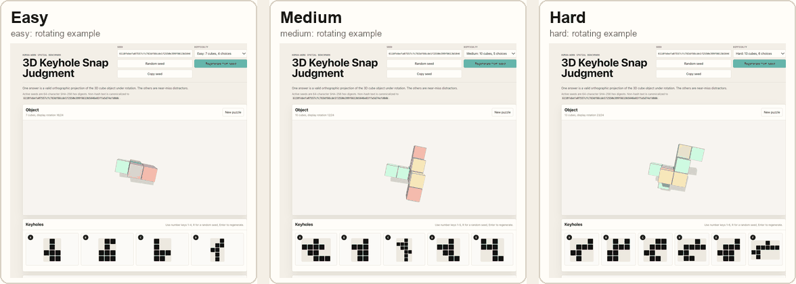

# Keyhole Proof

A puzzle CAPTCHA experiment.

You see a 3D block shape. Pick the 2D hole it could fit through.

The idea: this should be quick for people, but expensive for bots if they must calculate many shapes and rotations.




## Play

- Easy: 7 blocks, 4 choices
- Medium: 10 blocks, 5 choices
- Hard: 13 blocks, 6 choices

## Learn More

Read [documentation.md](documentation.md) for the full idea, seeds, SHA-256, and why this might make bot solving harder.

It is possible to precompute results for a known game design, but there could be some strategy to prevent that, that i am going to look into.

## Run It

```sh
npm install
npm run dev
```
